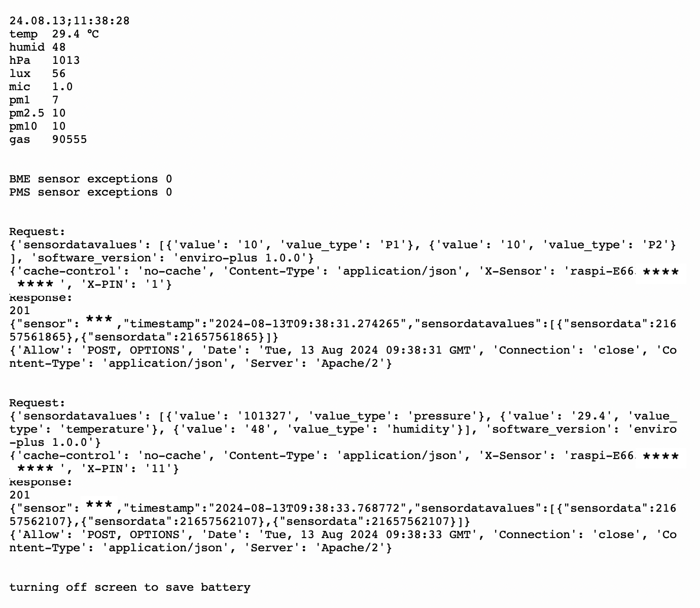

This code is for equipment combo Pico **W** / Enviro+ / PMS5003, and it sends data 
to https://sensor.community.

It reads: 
- **PM** data (very well), 
- **temp in Celsius** (very well), 
- **light** (very well), 
- **humidity** (very well), 
- **noise** (not so well), 
- **pressure** (very well),
- **gas** (not sure).

Gas sensor I didn't figure out yet what it reads. It does not read (it seems) when harsh
chemicals are felt in the air. Maybe it is not VOC gas.

To save data locally, without wifi, read [sensors data saving](../savetofile/README.md).

Setup
-----
Read contents of [main.py](main.py) for setup and explanations.

----

Below in the graph and chart you can see, that from a safe, low level, smoke fills the room and exceeds safety limits. Then it slowly dissipates and reaches safe level again. 

This is what it shows on screen: 

 

This is how [sensor.community](https://sensor.community) Grafana charts look, in moving 24h graph. You can see how often smoke fills the room (every spike), and how high the ppm levels are (max >900ppm - measurements on the left). Also when smokers are sleeping, and that they go for a smoke in middle of the night (3AM) but sleep until 10AM. 

 

Logging looks like so: 

 

